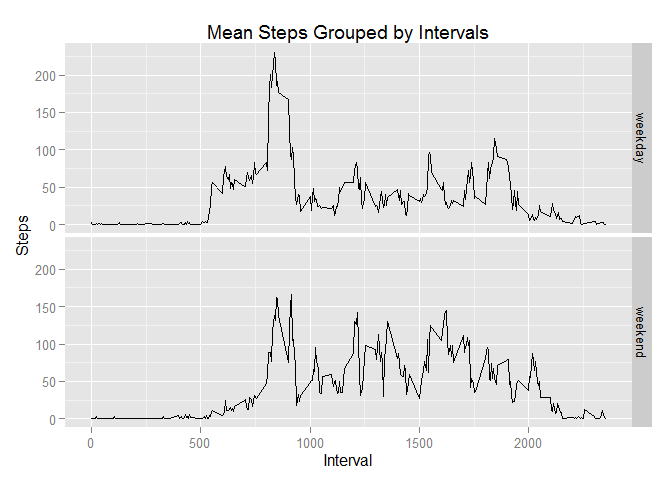

# Reproducible Research: Peer Assessment 1


## Loading and preprocessing the data
1. Load the data.

```r
    library(ggplot2)
    library(knitr)
```

```
## Warning: package 'knitr' was built under R version 3.2.2
```

```r
    fileurl <- "https://d396qusza40orc.cloudfront.net/repdata%2Fdata%2Factivity.zip"
    zipname <- "./data/repdata_data_activity.zip"
    datafile <- "./data/activity.csv"

    # Creating the data folder
    if (!file.exists("data")) {
        dir.create("data")
    }
    
    ## Download the file
    if (!file.exists(zipname)){
        download.file(fileurl, destfile=zipname, mode="wb")
    }
    # Unzipping the file 
    if (!file.exists(datafile) ){
        unzip(zipname, exdir="./data")
    }
    
    data <- read.csv(datafile,header=TRUE)
```

2. Process/transform the data (if necessary) into a format suitable for analysis


```r
    data$date <- as.POSIXct(data$date, format="%Y-%m-%d")
    str(data)
```

```
## 'data.frame':	17568 obs. of  3 variables:
##  $ steps   : int  NA NA NA NA NA NA NA NA NA NA ...
##  $ date    : POSIXct, format: "2012-10-01" "2012-10-01" ...
##  $ interval: int  0 5 10 15 20 25 30 35 40 45 ...
```

## What is mean total number of steps taken per day?

1. Make a histogram of the total number of steps taken each day

```r
    steps_by_date <- aggregate(steps~date, data, sum)
    g <- ggplot(data=steps_by_date, aes(x=date, y=steps)) +
        geom_histogram(stat="identity")+
        ggtitle("Total number of steps grouped by day")+
        ylab("Total number of steps") +
        xlab("Date")
    print(g)
```

 

2. Calculate and report the mean total number of steps taken per day


```r
    mean(steps_by_date$steps)
```

```
## [1] 10766.19
```

3. Calculate and report the median total number of steps taken per day

```r
    median(steps_by_date$steps)
```

```
## [1] 10765
```

## What is the average daily activity pattern?

1. Make a time series plot (i.e. type = "l") of the 5-minute interval (x-axis) and the average number of steps taken, averaged across all days (y-axis)


```r
    steps_by_interval <- aggregate(steps~interval, data, mean)
    g <- ggplot(steps_by_interval, aes(y=steps, x=interval))
    g <- g + geom_line(size=1) + xlab("Interval") + ylab(expression('Steps')) +
        ggtitle('Mean Steps Grouped by Intervals')
    print(g)
```

 

2. Which 5-minute interval, on average across all the days in the dataset, contains the maximum number of steps?

```r
    steps_by_interval$interval[steps_by_interval$steps==max(steps_by_interval$steps)]
```

```
## [1] 835
```

## Imputing missing values

1. Calculate and report the total number of missing values in the dataset (i.e. the total number of rows with NAs)


```r
    nas <- is.na(data$steps)
    sum(nas)
```

```
## [1] 2304
```

2. NA of steps are replaced by the average of 5-minute interval.


```r
    data_no_na <- data
    avg_interval <- tapply(data_no_na$steps, data_no_na$interval, mean, na.rm=TRUE,simplify=TRUE)
    data_no_na$steps[nas] <- avg_interval[as.character(data_no_na$interval[nas])]
    sum(is.na(data_no_na$steps))
```

```
## [1] 0
```


3. The new dataset without NA is:


```r
    head(data_no_na)
```

```
##       steps       date interval
## 1 1.7169811 2012-10-01        0
## 2 0.3396226 2012-10-01        5
## 3 0.1320755 2012-10-01       10
## 4 0.1509434 2012-10-01       15
## 5 0.0754717 2012-10-01       20
## 6 2.0943396 2012-10-01       25
```

4. Make a histogram of the total number of steps taken each day and Calculate and report the mean and median total number of steps taken per day. Do these values differ from the estimates from the first part of the assignment? What is the impact of imputing missing data on the estimates of the total daily number of steps?


```r
    steps_by_date <- aggregate(steps~date, data, sum)
    steps_by_date_no_na <- aggregate(steps~date, data_no_na, sum)
    g <- ggplot(data=steps_by_date_no_na, aes(x=date, y=steps)) +
        geom_histogram(stat="identity", fill="blue")+
        ggtitle("Total number of steps grouped by day")+
        ylab("Total number of steps") +
        xlab("Date") + 
        geom_histogram(data = steps_by_date, stat = "identity", fill = "red")
    print(g)
```

 


```r
    c(mean(steps_by_date$steps), mean(steps_by_date_no_na$steps))
```

```
## [1] 10766.19 10766.19
```

```r
    c(median(steps_by_date$steps),median(steps_by_date_no_na$steps))
```

```
## [1] 10765.00 10766.19
```

When replacing the NA values with the mean for that 5-minute interval, the impact on the mean and median of total steps taken per day is limited.

## Are there differences in activity patterns between weekdays and weekends?


1. Create a new factor variable in the dataset with two levels -- "weekday" and "weekend" indicating whether a given date is a weekday or weekend day.


```r
    weekday_weekend <- function(date) {
        if (weekdays(date)=="Sunday" || weekdays(date)=="Saturday") {
            factor("weekend")
        } else {
            factor("weekday")
        }
    }
    
    data_no_na$date.type <- mapply(weekday_weekend, data_no_na$date)
    steps_by_interval_by_week <- aggregate(x=data_no_na$steps, 
                by=list(data_no_na$interval, data_no_na$date.type), FUN=mean)
    names(steps_by_interval_by_week) <- c("interval", "date.type", "steps")
    head(steps_by_interval_by_week)
```

```
##   interval date.type      steps
## 1        0   weekday 2.25115304
## 2        5   weekday 0.44528302
## 3       10   weekday 0.17316562
## 4       15   weekday 0.19790356
## 5       20   weekday 0.09895178
## 6       25   weekday 1.59035639
```

```r
    tail(steps_by_interval_by_week)
```

```
##     interval date.type       steps
## 571     2330   weekend  1.38797170
## 572     2335   weekend 11.58726415
## 573     2340   weekend  6.28773585
## 574     2345   weekend  1.70518868
## 575     2350   weekend  0.02830189
## 576     2355   weekend  0.13443396
```


2. Make a panel plot containing a time series plot (i.e. type = "l") of the 5-minute interval (x-axis) and the average number of steps taken, averaged across all weekday days or weekend days (y-axis). The plot should look something like the following, which was created using simulated data:


```r
    g <- ggplot(data=steps_by_interval_by_week, aes(x=interval, y=steps)) +
            geom_line(stat="identity")+ xlab("Interval") + ylab(expression('Steps')) +
            ggtitle('Mean Steps Grouped by Intervals') + facet_grid(date.type~.)
    print(g)
```

 
